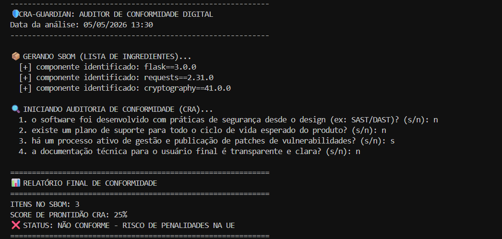

  

  
  
  

---

## 📖 Sobre a Origem do Projeto

[cite_start]Este projeto foi desenvolvido como parte prática do módulo **CRA: EL MARCADO CE DEL SOFTWARE**, integrante do curso de Ciberseguridad Aplicada da **Universidad de Salamanca (USAL)** e do projeto **CIBERIA**[cite: 1, 6].

[cite_start]A **Cyber Resilience Act (CRA)** é a primeira regulação horizontal da União Europeia que estabelece requisitos obrigatórios de cibersegurança para produtos com elementos digitais[cite: 2, 10]. [cite_start]O objetivo central é garantir que hardware e software incorporem medidas de segurança antes de serem comercializados no mercado europeu[cite: 11].

---

## 🎯 Justificativa: Do Físico ao Digital

[cite_start]Historicamente, o marcado CE focava na segurança física (brinquedos, máquinas, eletrodomésticos) para evitar danos aos consumidores[cite: 18, 19, 20]. [cite_start]A CRA expande esse conceito: agora, produtos digitais devem demonstrar que cumprem requisitos básicos de cibersegurança para serem vendidos na UE[cite: 21, 23, 29].

O **CRA-Guardian** automatiza a verificação de dois pilares críticos desta lei:
1.  [cite_start]**Segurança desde o Design (Security by Design):** A segurança deve ser integrada desde o início do desenvolvimento, e não como uma fase final[cite: 30, 50, 61].
2.  [cite_start]**Gestão de Vulnerabilidades:** Fabricantes devem monitorar, documentar e publicar atualizações durante todo o ciclo de vida do produto[cite: 53, 54, 55, 72].

---

## 🚀 Funcionalidades Técnicas

### 📦 Geração de SBOM (Software Bill of Materials)
[cite_start]O script gera um inventário estruturado (a "lista de ingredientes") de todos os componentes e dependências do software[cite: 79, 88].
* [cite_start]**Por que importa?** Permite reagir rapidamente a vulnerabilidades conhecidas (como o Log4j), identificando em minutos quais produtos estão afetados[cite: 92, 93, 94].

### 🔍 Auditoria de Prontidão (Checklist)
[cite_start]O sistema avalia a conformidade do projeto com base nas obrigações legais da CRA[cite: 45, 46]:
* [cite_start]Verificação de práticas de **SDLC Seguro**[cite: 52].
* [cite_start]Avaliação da transparência das informações fornecidas ao usuário final[cite: 57, 58].
* [cite_start]Auditoria de planos de suporte para o ciclo de vida esperado do produto[cite: 47, 49].

---

## 💻 Exemplo Prático de Execução

Ao rodar o auditor em um projeto que possui dependências mas falha nos processos de suporte e design seguro, o sistema identifica o risco de penalidades legais. Abaixo, um exemplo da ferramenta identificando um software com **apenas 25% de conformidade**:

  

> [cite_start]**Nota:** Este resultado indica que, embora o SBOM tenha sido gerado e haja gestão de vulnerabilidades, o produto falha em requisitos essenciais para obter o **Marcado CE Digital**[cite: 28, 115].

---

## 👩‍💻 Autora

**Victória Santos Suares da Silva** *Estudante de Engenharia de Software e Pesquisadora em IA Justa e Transparente.* Foco em Segurança Ofensiva, Análise de Vulnerabilidades e Ciberdireito.

* **LinkedIn:** [https://www.linkedin.com/in/victoria-suares/](https://www.linkedin.com/in/victoria-suares/)
* **GitHub:** [@suares13](https://github.com/suares13)